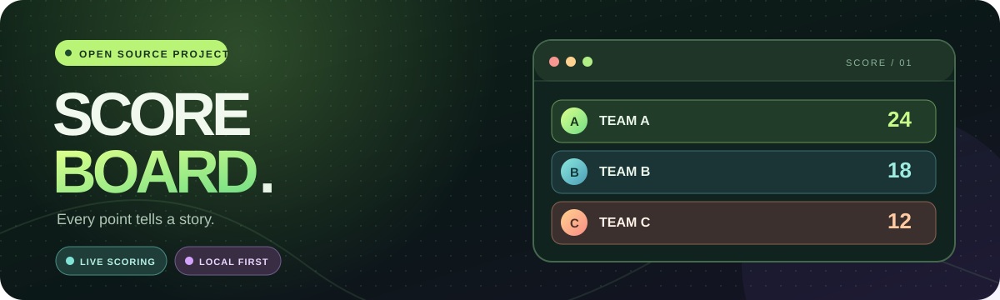
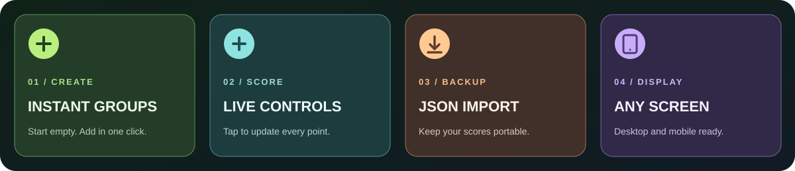

[🌐 Choose a language](../../README.md) · [繁體中文](./README.zh-TW.md) · [简体中文](./README.zh-CN.md) · **English** · [日本語](./README.ja.md)

<p align="center"></p>

<h1 align="center">Scoreboard · Live scores for every event</h1>

<p align="center">A lightweight scoreboard for creating groups, tracking points, and keeping every result.</p>

<p align="center"><a href="https://score-board-4gz.pages.dev/"></a></p>

> The app supports Traditional Chinese, Simplified Chinese, English, and Japanese. Switch languages in the top bar; names and scores stay as you entered them.

## ✨ Features



| Feature | How it works |
| :--- | :--- |
| 🟢 **Create groups** | A new board starts empty. Select **Add team** to create **New team**, then use the pencil icon to rename it. |
| ⚡ **Update scores** | Use `+1` and `−1`, or select a score to enter an integer directly. |
| 🏆 **See the ranking** | Groups are sorted by score. The overview shows the group count, highest score, and leader. |
| 🧹 **Manage the board** | Rename the board, delete groups, or reset all scores after confirmation. |
| 📦 **Import and export** | Download a JSON backup or import one on another browser or device. Importing asks before replacing current data. |
| 📱 **Use any screen** | The dark layout adapts to desktop and mobile screens. |

## 🎮 Get started

**Online:** Open **[score-board-4gz.pages.dev](https://score-board-4gz.pages.dev/)**. No account or installation is required.

**Locally:**

```bash
git clone https://github.com/easonlin2013927/score-board.git
cd score-board
```

Open `index.html` in a browser. This is a static site with no dependencies or build step.

### Typical workflow

1. Use the pencil beside the title to rename the scoreboard.
2. Select **Add team**, then use the pencil on its card to enter the team name.
3. Use the score buttons, or select the number to set a score directly.
4. Select **Export scoreboard** to save a JSON backup.

## 💾 Data and backups

Names and scores are saved automatically in the **current browser's** `localStorage`. They survive page reloads but **do not sync between devices**. To move a board, export its JSON file and import it in the other browser.

Importing replaces the current board and scores after a confirmation prompt. If old groups still appear after an update, they came from data saved in that browser; delete them in the app or clear this site's browser data.

## ☁️ Deploy to Cloudflare Pages

This repository is connected to Cloudflare Pages; pushes to `main` deploy automatically. To deploy your own copy, choose **Workers & Pages → Create application → Pages → Connect to Git**, select this repository, and use these settings:

| Setting | Value |
| :--- | :--- |
| Production branch | `main` |
| Framework preset | `None` |
| Build command | Leave blank |
| Build output directory | Repository root `/`; if `/` is already shown as a prefix, leave the input blank |
| Root directory and environment variables | Leave blank |

To add a domain later, open **Custom domains → Set up a domain** in the Pages project. See [Cloudflare's custom domain guide](https://developers.cloudflare.com/pages/configuration/custom-domains/) for root domain and subdomain DNS requirements.

## 🧩 Project structure

```text
score-board/
├─ index.html         # Page layout and dialogs
├─ styles.css         # Main and responsive styles
├─ github-link.css    # GitHub button in the sidebar
├─ language.css       # Language selector styles
├─ i18n.js            # Interface text in four languages
├─ app.js             # Scoring, storage, import, and export
├─ favicon.svg        # Site icon
└─ docs/              # README graphics and translations
```

<p align="center"><strong>🎯 Every point tells a story.</strong></p>
